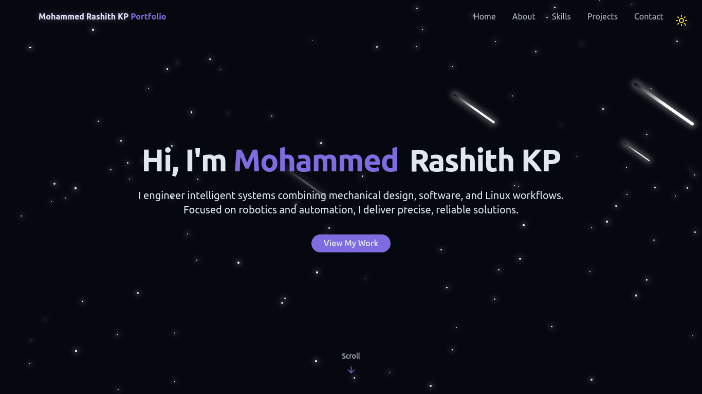

# Mohammed Rashith KP 's Portfolio Website

This is my personal portfolio website built with [vite](https://vitejs.dev/) and [React](https://react.dev/).It showcases my projects, skills and ways to get in touch.
## Live Demo

[Visit Portfolio](https://mrkp-dev.netlify.app)

## Features
- Fast loading thanks to Vite bundling
- Responsive design
- Contact Form integration with Netlify
- Social media links
- Modern React hooks and component structure

## Tech Stack
- React 
- Vite
- Tailwind CSS
- Lucide Icons
- Netlify (for deployment)

## Setup Instructions

1. Clone the repo
```bash
git clone https://github.com/mohammedrashithkp/portfolio-website.git && cd portfolio-website
```
2. Install the dependencies
``` bash
npm install
```
3. Start the development server
```bash
npm run dev
```
4. Open [https://localhost:5173](https"//localhost:5173)

## Deployment
This site is deployed to Netlify.Pushes to the master branch automatically trigger a redeploy


